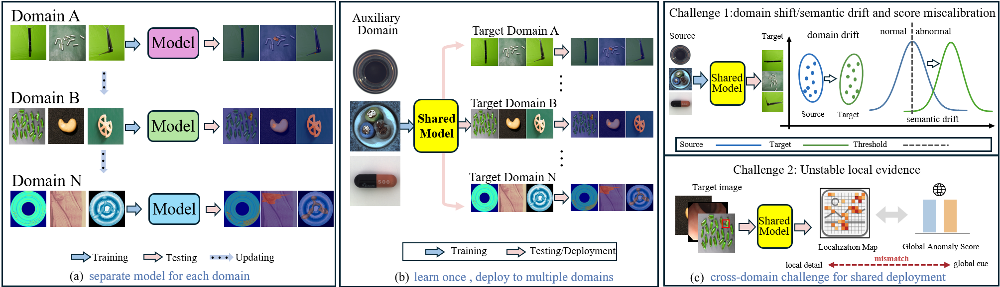

<div align="left"> 
<h1> 📌 I-CAST </h1>
<h3>I-CAST: Industrial Cross-Domain Anomaly Detection via Semantic Anchors and Task-Decoupled Adapter</h3>
</div>


<div align="center">  </div>

<div align="justify">

## ⭐ Abstract 
Industrial anomaly detection aims to identify defective patterns across diverse manufacturing scenarios, but its deployment to unseen production domains is severely hindered by the extreme scarcity of defect samples and unpredictable distribution shifts. While vision-language models (VLMs) offer promising zero-shot potential to enable a shared anomaly detection model across diverse industrial scenarios, their application suffers from semantic drift and unreliable localization under domain shifts. To address these challenges, we propose I-CAST, a parameter-efficient adaptation framework for zero- and few-shot cross-domain inspection. I-CAST employs Semantic Anchor Prompt Learning (SAPL) to establish domain-invariant semantic anchors, mitigating domain drift without target-domain retraining. Additionally, a Task-Decoupled Visual Adapter (TDVA) extracts separate task-aware token streams from frozen features, effectively decoupling representations for accurate image-level detection and pixel-level segmentation. An inference-only memory bank further enables few-shot adaptation without parameter updates. Extensive experiments across 13 diverse benchmarks demonstrate that I-CAST achieves state-of-the-art cross-domain transferability in both target-domain zero-shot and few-shot anomaly detection scenarios.
</div>

📴**Keywords**: Anomaly detection and localization, cross-domain transfer, few-shot learning, industrial inspection, vision-language model, zero-shot learning

<div align="center">  </div>


## 🚀 Get Started

⚙️ Environment
- python >= 3.8.5
- pytorch >= 1.10.0
- torchvision >= 0.11.1
- numpy >= 1.19.2
- scipy >= 1.5.2
- kornia >= 0.6.1
- pandas >= 1.1.3
- opencv-python >= 4.5.4
- pillow
- tqdm
- ftfy
- regex

### Device
Single NVIDIA A40 GPU

## 📦 Pretrained model
- CLIP: ##################################################################

    👉 Download and put it under `CLIP/ckpt` folder


## 🏥🏭 Medical and Industrial Anomaly Detection Benchmark(2D\3D)

1. We will provide the pre-processed benchmark. Please download the following dataset

    

2. Place it within the master directory `data` and unzip the dataset.

    ```
    
    ```


## 📂 File Structure
After the preparation work, the whole project should have the following structure:

```
code
├─ ckpt
│  └─ zero-shot
├─ CLIP
│  ├─ bpe_simple_vocab_16e6.txt.gz
│  ├─ ckpt
│  │  └─ ViT-L-14-336px.pt
│  ├─ clip.py
│  ├─ model.py
│  ├─ models.py
│  ├─ model_configs
│  │  └─ ViT-L-14-336.json
│  ├─ modified_resnet.py
│  ├─ openai.py
│  ├─ tokenizer.py
│  └─ transformer.py
├─ data
│  ├─ Mvtec3D
│  │  ├─ valid
│  │  └─ test
│  ├─ BTAD
│  │  ├─ valid
│  │  └─ test
│  ├─ Mvtec
│  │  ├─ valid
│  │  └─ test
│  ├─ ...
│  └─ Visa
│     ├─ valid
│     └─ test
├─ dataset
│  ├─ fewshot_seed
│  │  └─ Mvtec3D
│  ├─ medical_few.py
│  └─ medical_zero.py
├─ loss.py
├─ readme.md
├─ train_few.py
├─ train_zero.py
├─ test.py
└─ utils.py

```


## ⚡ Quick Start

`python test.py`

For example, to test on the Visa , simply run:

`###########################`

### Training

`python train_zero.py`


## 🖼️ Visualization
<center></center>
<center></center>


## 🙏 Acknowledgement
We borrow some codes from [OpenCLIP](https://github.com/mlfoundations/open_clip), and [April-GAN](https://github.com/ByChelsea/VAND-APRIL-GAN).

## 📬 Contact

If you have any problem with this code, please feel free to contact **** and ****.

